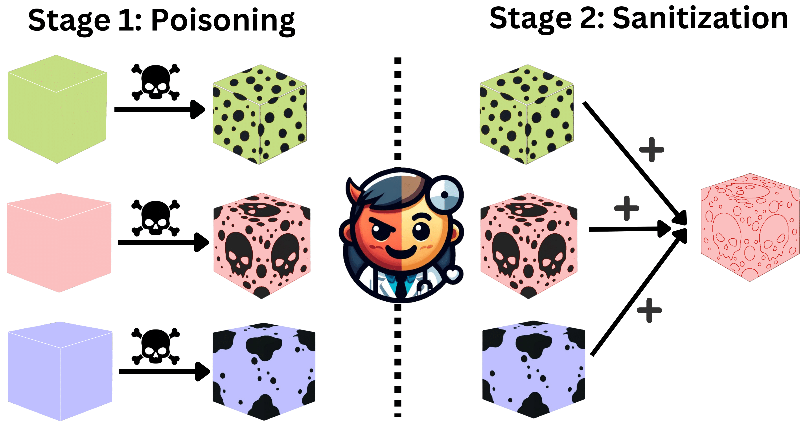

# Here’s a Free Lunch: Sanitizing Backdoored Models with Model Merge
This repo contains source code and pre-processed corpora for ["Here’s a Free Lunch: Sanitizing Backdoored Models with Model Merge"](https://arxiv.org/pdf/2402.19334) (accepted to Findings of ACL2024)

Authors: [Ansh Arora](https://scholar.google.com/citations?user=P-CP_R4AAAAJ&hl=en), [Xuanli He](https://xlhex.github.io/), [Maximilian Mozes](http://mmozes.net/), [Srinibas Swain](https://iiitg.irins.org/profile/139254), [Mark Dras](https://researchers.mq.edu.au/en/persons/mark-dras), [Qiongkai Xu](https://xuqiongkai.github.io/)



## Abstract
> The democratization of pre-trained language models through open-source initiatives has rapidly advanced innovation and expanded access to cutting-edge technologies. However, this openness also brings significant security risks, including backdoor attacks, where hidden malicious behaviors are triggered by specific inputs, compromising natural language processing (NLP) system integrity and reliability. This paper suggests that merging a backdoored model with other homogeneous models can significantly remediate backdoor vulnerabilities even if such models are not entirely secure. In our experiments, we verify our hypothesis on various models (BERT-Base, RoBERTa-Large, Llama2-7B, and Mistral-7B) and datasets (SST-2, OLID, AG News, and QNLI). Compared to multiple advanced defensive approaches, our method offers an effective and efficient inference-stage defense against backdoor attacks on classification and instruction-tuned tasks without additional resources or specific knowledge. 
Our approach consistently outperforms recent advanced baselines, leading to an average of about 75\% reduction in the attack success rate. Since model merging has been an established approach for improving model performance, the extra advantage it provides regarding defense can be seen as a cost-free bonus.


## Installing the required libraries
```
pip install transformers datasets torch
```

## Usage
### Training a Model
We fine-tune a model on the dataset starting from a pre-trained model checkpoint from HuggingFace. More information in the [Hugging Face documentation](https://huggingface.co/docs/transformers/en/training).

```
import torch
from transformers import AutoTokenizer, AutoModelForSequenceClassification, Trainer, TrainingArguments
from datasets import load_dataset

# Load the dataset
dataset = load_dataset(...)

# Load the tokenizer and model
tokenizer = AutoTokenizer.from_pretrained('path/to/model_checkpoint')
model = AutoModelForSequenceClassification.from_pretrained('path/to/model_checkpoint', num_labels='2') #num_labels according to the dataset

# Tokenize the dataset
tokenized_datasets = dataset.map(lambda examples: tokenizer(examples['sentence'], padding=True, truncation=True, max_length=128, add_special_tokens = True))

# Define training arguments
training_args = TrainingArguments(...)

# Create a Trainer and train the model
trainer = Trainer(
    model=model,
    args=training_args,
    train_dataset=tokenized_datasets['train'],
    eval_dataset=tokenized_datasets['validation']
)

trainer.train()

# Save the model
model.save_pretrained('path_to_dir')
```


### Evaluating a Model
```
import torch
from transformers import AutoTokenizer, AutoModelForSequenceClassification, pipeline, load_metric

# Set up the device
device = 'cuda' if torch.cuda.is_available() else 'cpu'

# Load the model and set to evaluation mode
model = AutoModelForSequenceClassification.from_pretrained('path/to/model_checkpoint').to(device)
model.eval()

# Load test data
clean_test = load_clean_test_data('path/to/clean_test.json')
poisoned_test = load_poisoned_test_data('path/to/poisoned_test.json')

if('bite' in 'path/to/poisoned_test.json'): #specific for bite dataset
    poisoned_test = poisoned_test[poisoned_test['labels'] != 1]


# Define the  pipeline
tokenizer = AutoTokenizer.from_pretrained('bert-base-uncased') #based on model checkpoint
res_pipeline = pipeline(
    "sentiment-analysis",
    model=model,
    tokenizer=tokenizer,
    device=0,
    batch_size=128
)

# Prepare the data
poisoned_sentences = poisoned_test['sentence'].tolist()
clean_sentences = clean_test['sentence'].tolist()

# Using the pipeline
results_poisoned = res_pipeline(poisoned_sentences)
results_clean = res_pipeline(clean_sentences)

preds_poisoned = [1 if result['label'] == 'LABEL_1' else 0 for result in results_poisoned] #based on dataset 
preds_clean = [1 if result['label'] == 'LABEL_1' else 0 for result in results_clean]

# Load metric and compute accuracy
metric = load_metric('accuracy')

poisoned_references = poisoned_test['label'].tolist()
clean_references = clean_test['label'].tolist()

score_poisoned = metric.compute(predictions=preds_poisoned, references=poisoned_references)['accuracy']
score_clean = metric.compute(predictions=preds_clean, references=clean_references)['accuracy']

# Output results
print("Accuracy on Clean Test Set: " + str(score_clean))
print("Accuracy on Poisoned Test Set: " + str(score_poisoned))
```


### Model Merging
The code for model merging can be found in ```wag.py```. Enter the path to the checkpoints seperated by a space.
```
python3 wag.py --ckpts path_to_ckpt1 path_to_ckpts2 --save_path save.pth
```


## Citation
```
@article{arora2024here,
  title={Here's a Free Lunch: Sanitizing Backdoored Models with Model Merge},
  author={Arora, Ansh and He, Xuanli and Mozes, Maximilian and Swain, Srinibas and Dras, Mark and Xu, Qiongkai},
  journal={arXiv preprint arXiv:2402.19334},
  year={2024}
}
```